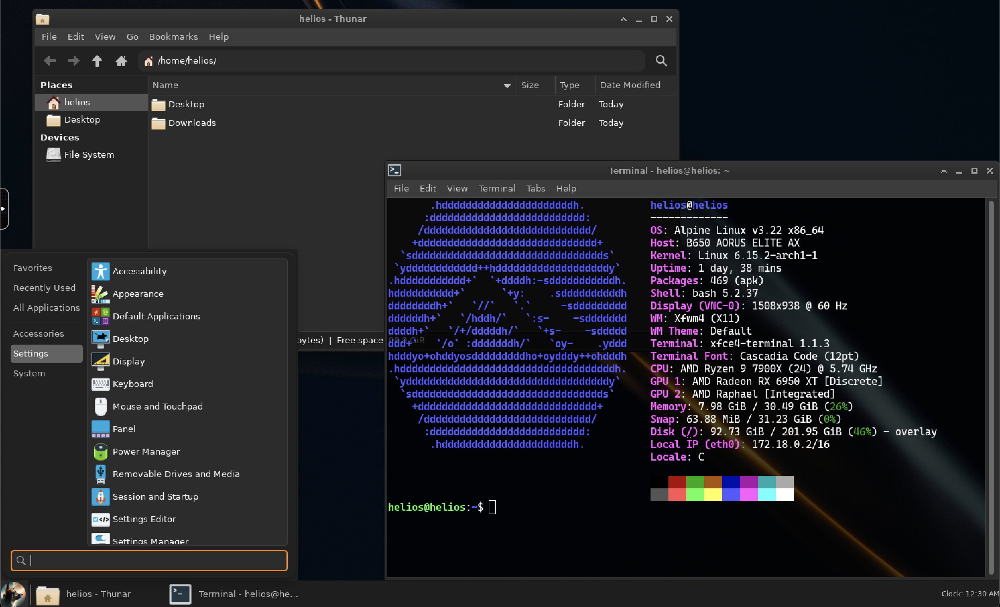

 

    
    

        Containerized Workstations for the Future.
    

---

---

[Official Documentation](https://juno-fx.github.io/Helios/)

Helios provides base images for multiple key Linux distributions, optimized to be as small as possible to:

- Reduce pull times
- Minimize the attack surface
- Lower data transfer costs

These images are lightweight, efficient, and ready to use across environments like Docker, Kubernetes, and more.

Some key points about Helios:

- **Base Images**: Designed as base images for Selkies-compatible deployments.
- **Extremely Minimal Desktops**: Images are intentionally minimal; avoid adding software directly. Instead, extend via the `FROM` instruction in your Dockerfile.

## 📚 Table of Contents

- 🚀 [Features](#✨-features)
- ⚙️ [Selkies Setup](#⚙️-selkies-setup)
- 🐧 [Distros Overview](#🐧-distros-overview)
  - Debian
    - [Debian 12 (Bookworm)](#debian-12-bookworm)
  - Ubuntu
    - [Ubuntu 24.04 (Noble)](#ubuntu-2404-noble)
    - [Ubuntu 22.04 (Jammy)](#ubuntu-2204-jammy)
  - RHEL
    - [Rocky Linux 9](#rocky-linux-9)
    - [Alma Linux 9](#alma-linux-9)
- 🏷️ [Versioning](#%EF%B8%8F-versioning)
- ⚡ [Usage](https://juno-fx.github.io/Helios/deploy-usage/)
- 🤝 [Contributing](CONTRIBUTING.md)

---

## ✨ Features

- **Lightweight**: Minimal resource usage for efficient performance.
- **WebRTC Support** (Coming Soon): High performance, low-latency video streaming.
- **Audio Support** (Coming Soon): High-quality audio streaming for improved user experience.
- **VirtualGL Support**: Hardware-accelerated 3D graphics using `vglrun`.

---

## ⚙️ Selkies Setup

We maintain the latest versions of Selkies components to ensure access to the newest features and bug fixes:

- **Selkies**: [d4b2c32b65c58329e14d580784d4cbb98cb44564](https://github.com/selkies-project/selkies/tree/d4b2c32b65c58329e14d580784d4cbb98cb44564)

---

## 🐧 Distros Overview

Explore the supported Linux distributions with their versions, image sizes, and X Server details.

### Debian Family

#### [Debian 12 (Bookworm)](https://hub.docker.com/_/debian/tags?name=bookworm)

- **Size:** 1.55 GB

---

### Ubuntu Variants

#### [Ubuntu 24.04 (Noble)](https://hub.docker.com/_/ubuntu/tags?name=noble)

- **Size:** 1.4 GB

#### [Ubuntu 22.04 (Jammy)](https://hub.docker.com/_/ubuntu/tags?name=jammy)

- **Size:** 1.29 GB

---

### Red Hat Ecosystem

#### [Rocky Linux 9](https://hub.docker.com/_/rockylinux/tags?name=9)

- **Size:** 1.68 GB

#### [Alma Linux 9](https://hub.docker.com/_/almalinux/tags?name=9)

- **Size:** 1.46 GB

## 🏷️ Versioning

Helios uses its own versioning scheme independent of the underlying distro versions. The format is: `v0.0.0-codename` where `codename` represents the underlying distro. This allows tracking Helios changes separately from distro updates.

### Examples

| Helios Version    | Distro               |
|-------------------|----------------------|
| `v0.0.0-bookworm` | Debian 12 (Bookworm) |
| `v0.0.0-noble`    | Ubuntu 24.04         |
| `v0.0.0-jammy`    | Ubuntu 22.04         |
| `v0.0.0-rocky-9`  | Rocky Linux          |
| `v0.0.0-alma-9`   | Alma Linux           |

---

### Additional Tags

- **Unstable builds** (from the `main` branch): Intended for testing and development only. These builds **may contain bugs or incomplete features**.

  Examples:
  - `unstable-bookworm` (Debian 12)
  - `unstable-noble` (Ubuntu 24.04)
  - `unstable-jammy` (Ubuntu 22.04)
  - `unstable-rocky-9` (Rocky Linux)
  - `unstable-alma-9` (Alma Linux)

- **Testing builds** (from the `testing` branch): For testing new features before merging into `main`. Also **may contain bugs or incomplete features**.

  Examples:
  - `testing-noble` (Ubuntu 24.04)
  - `testing-bookworm` (Debian 12)
  - `testing-jammy` (Ubuntu 22.04)
  - `testing-rocky-9` (Rocky Linux)
  - `testing-alma-9` (Alma Linux)

