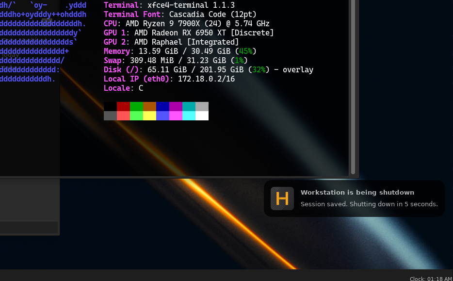
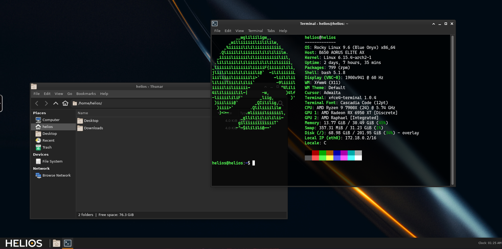

# XFCE4 Session

Helios ships with a default `shutdown.d` script that saves the current xfce4 desktop session to the user's home directory.
This allows the workstation to relaunch all applications that were running when the session was closed.


## Docker Compose

!!! note "Docker Compose Version"
    `pre_stop` is only available in Docker Compose version 2.30.0 and above. Ensure you are using a compatible version. You can read more about this feature in the [Docker Compose documentation](https://docs.docker.com/compose/how-tos/lifecycle/).

To enable this feature, you need to follow these steps:

1. **Mount a Persistent Volume**: Ensure that you have a persistent volume mounted to `/home` in your container. This is where the session data will be stored.
2. **Add a Pre-Stop Directive**: Modify your `compose.yaml` file to include a `pre_stop` directive that points to the shutdown script located at `/etc/helios/shutdown.d/custom.sh`.
3. **Example Compose File**: Below is an example of how to set this up in your `compose.yaml` file:

```yaml
services:
  helios:
    image: helios:v0.0.0-noble
    container_name: my-helios-container
    pre_stop:
      - command: /etc/helios/shutdown.d/custom.sh
    volumes:
      - /path/to/persistent/home:/home
    restart: unless-stopped
```

This will ensure that the session is saved when the container is stopped, allowing you to resume 
your work on next launch.

## Kubernetes

In a Kubernetes environment, you can achieve similar functionality by using a `preStop` hook in your pod specification. This hook will execute the shutdown script before the container is terminated.

To enable this feature, you need to follow these steps:

1. **Mount a Persistent Volume**: Ensure that you have a persistent volume mounted to `/home` in your pod. This is where the session data will be stored.
2. **Add a Pre-Stop Hook**: Modify your pod specification to include a `preStop` hook that points to the shutdown script located at `/etc/helios/shutdown.d/custom.sh`.
3. **Example Pod Specification**: Below is an example of how to set this up in your pod specification:

```yaml
apiVersion: v1
kind: Pod
metadata:
  name: my-helios-pod
spec:
    containers:
    - name: helios
      image: helios:v0.0.0-noble
      volumeMounts:
        - name: home-volume
          mountPath: /home
      lifecycle:
        preStop:
          exec:
            command: ["/etc/helios/shutdown.d/custom.sh"]
    volumes:
        - name: home-volume
          persistentVolumeClaim:
            claimName: my-pvc
```

This will ensure that the session is saved when the pod is terminated, allowing you to resume
your work on next launch.

## Example Workflow

Here is an example workflow for using session persistence with Helios:

1. **Launch a Helios Container**: Start your Helios container with the necessary configurations as described above.
2. **Run Your Applications**: Use the Helios desktop environment to run your applications as you normally would.
   
3. **Shutdown the Container**: When you are done, shut down the container. The shutdown script will automatically save your session.
   
4. **Select a Different Helios Container Distro**: If you want to switch to a different Helios container distro, such as Rocky Linux, you can do so without losing your session.
5. **Launch the New Container**: Start the new Helios container with the same persistent volume mounted to `/home`.
6. **Resume Your Session**: The new container will automatically restore your previous session, allowing you to continue where you left off.
   


